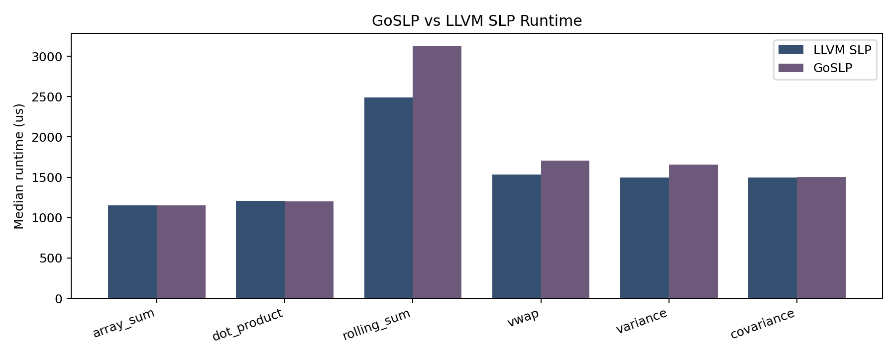
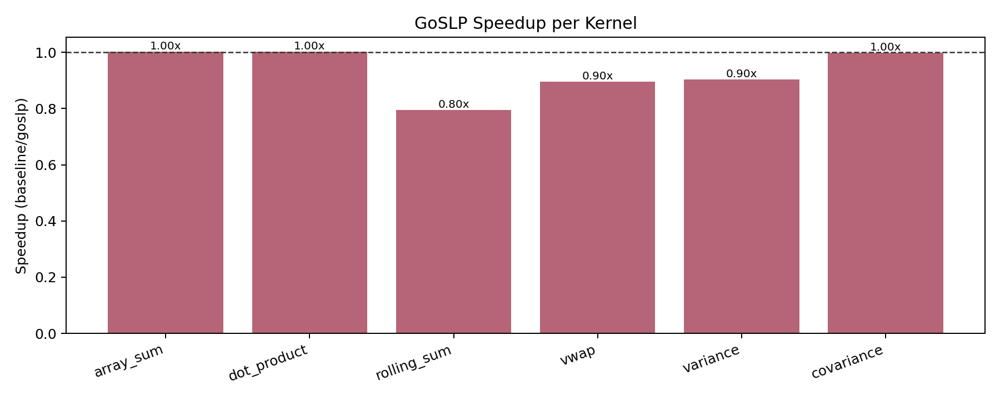
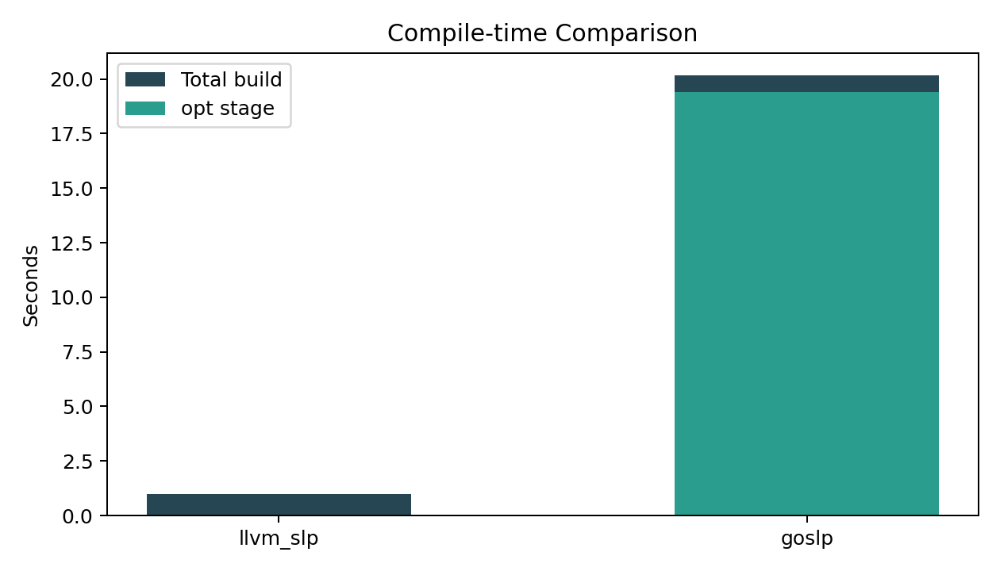

# GoSLP for LLVM (Paper-Parity + AArch64 Reduction Extension)

This repository contains an LLVM pass plugin implementing a GoSLP-style superword-level vectorizer and a reduction-aware extension for Apple Silicon (AArch64 fixed-width SIMD).

## What This Project Now Includes

### 1) Core GoSLP pipeline (paper-aligned)

The pass implements the staged flow described in the GoSLP paper:

- candidate statement packing over whole-function scope (while pairing only within a basic block)
- vectorization use maps (`VecVecUses`) and non-vector pack use maps (`NonVecVecUses`)
- pairwise pack selection using a constrained ILP-style branch-and-bound search
- overlap and circular-dependency conflict handling
- iterative widening of pair packs
- lane-permutation selection with dependency-aware DP
- IR emission for selected packs (load/store/arithmetic)

Main source files:

- `GoSLP/GoSLPPass/CandidatePacks.cpp`
- `GoSLP/GoSLPPass/ILP.cpp`
- `GoSLP/GoSLPPass/PermuteDP.cpp`
- `GoSLP/GoSLPPass/Emit.cpp`
- `GoSLP/GoSLPPass/GoSLPPass.cpp`

Paper-parity gap notes (explicit):

- The original paper used an external ILP solver (CPLEX). This implementation uses an in-tree bounded branch-and-bound ILP-equivalent search because CPLEX is not available in this environment.
- The implementation keeps pairwise local objective encoding and iterative widening behavior, but practical guardrails are applied to keep compile time bounded on large functions.

### 2) Compile-time improvements (Phase 2)

Implemented compile-time guardrails and solver throttling:

- isomorphic bucketed candidate pairing (avoids all-to-all statement pairing)
- per-bucket pair-check budgets
- candidate-pack cap for tractability
- circular-conflict build cap for large candidate sets
- dynamic ILP time budget based on candidate count
- reduced non-debug logging to lower pass overhead

Measured compile-time improvement on a representative heavy reduction-like workload (`heavy`):

- before: `15.56s`
- after: `4.15s`
- improvement: `~3.75x`

(Measurement command used `opt -passes="GoSLPPass(func:heavy)"` on the same IR input.)

### 3) Reduction-aware extension for AArch64/Apple Silicon (Phase 3)

Added reduction support in:

- `GoSLP/GoSLPPass/Reduction.cpp`

Current MVP behavior:

- detects single-basic-block add/fadd reduction trees/chains
- enabled only on AArch64 target triples
- forms vector work for reduction leaves (prefers direct vector load for contiguous leaves)
- emits horizontal reduction (`llvm.vector.reduce.add.*` / `llvm.vector.reduce.fadd.*`)
- applies cost guardrails before transforming
- includes graph-size guardrails for large reduction structures

Example effect:

- scalar add-chain reductions can be rewritten to vector-reduce IR (see generated `llvm.vector.reduce.*` calls when running pass on a reduction kernel with `func:` filtering).

## Validation

Automated validation script:

```bash
GoSLP/tests/run_validation.sh
```

It checks:

- successful build integration
- correctness for transformed kernels
- expected IR-level vectorization behavior on representative positive/negative cases

## New 6-Benchmark Suite (Phase 4)

The previous toy benchmark flow was replaced with a realistic numeric suite in:

- `GoSLP/bench/suite.cpp`
- `GoSLP/bench/bench.sh`
- `GoSLP/bench/plot_results.py`

Kernels:

1. `array_sum`
2. `dot_product`
3. `rolling_sum`
4. `vwap`
5. `variance`
6. `covariance`

Each benchmark has:

- a block-style optimized kernel path
- a scalar reference path
- runtime validation via checksum/tolerance checks

## How to Run Benchmarks

From repo root:

```bash
cd GoSLP
./bench/bench.sh all 100 8192 3
```

Arguments:

- arg1: kernel name or `all`
- arg2: iterations
- arg3: problem size (`n`, rounded to block multiple)
- arg4: repeats (median runtime reported)

The script builds and compares:

- LLVM baseline (`-O3 -march=native`, default LLVM vectorization)
- GoSLP pipeline (`-O3 -march=native`, IR transformed with plugin)

Outputs:

- `GoSLP/bench/results/runtime.csv`
- `GoSLP/bench/results/compile.csv`
- `GoSLP/bench/results/runtime_comparison.png`
- `GoSLP/bench/results/runtime_speedup.png`
- `GoSLP/bench/results/compile_time.png`

## Latest Benchmark Results (from `runtime.csv`)

| Kernel | LLVM SLP us | GoSLP us | Speedup (baseline/goslp) |
|---|---:|---:|---:|
| array_sum | 1154 | 1152 | 1.00x |
| dot_product | 1208 | 1204 | 1.00x |
| rolling_sum | 2487 | 3126 | 0.80x |
| vwap | 1532 | 1709 | 0.90x |
| variance | 1496 | 1656 | 0.90x |
| covariance | 1500 | 1501 | 1.00x |

All benchmark checksums matched between baseline and GoSLP runs.

## Compile-Time Snapshot (from `compile.csv`)

| Variant | Build seconds | opt stage seconds | Assembly instruction lines |
|---|---:|---:|---:|
| llvm_slp | 0.99 | 0.00 | 1266 |
| goslp | 20.17 | 19.42 | 1265 |

## Graphs







## Important Remaining Limitations

- ILP solving remains expensive on larger functions; guardrails improve practicality but can reduce search completeness.
- Emission currently focuses on load/store/binary-op vector rewrites and is less complete for broader IR op classes.
- Reduction support is intentionally scoped to clear single-basic-block cases on AArch64 and does not include loop-vectorizer integration.
- Min/max and explicit mul-acc reduction-specialization are not yet implemented as dedicated reduction modes.
